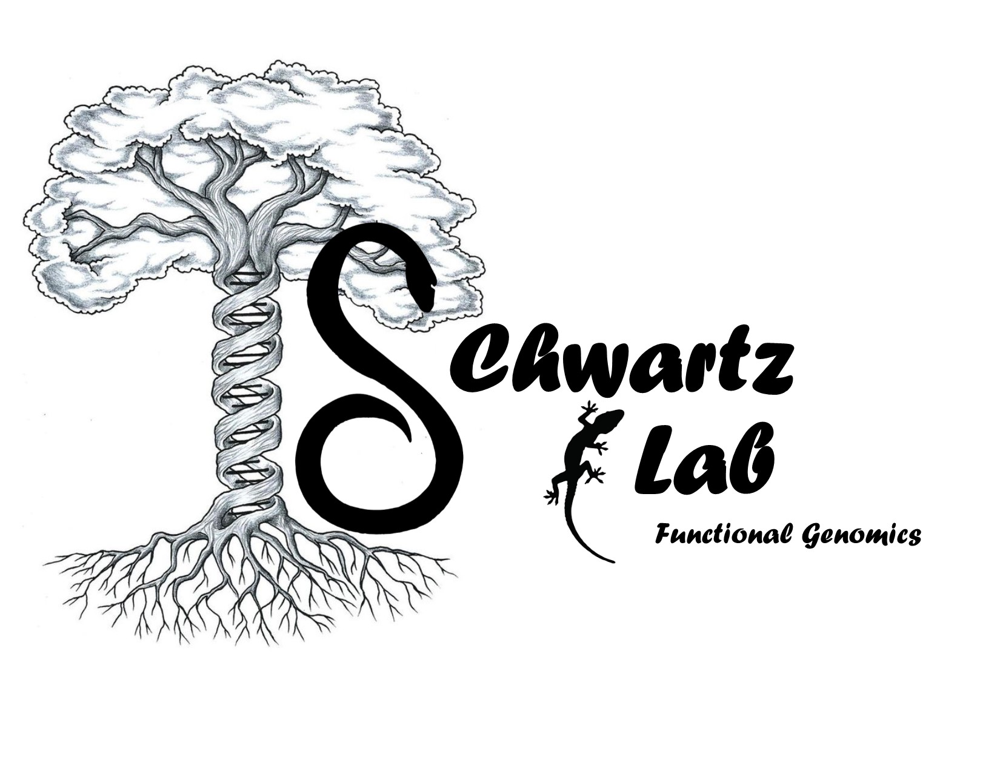

## **Post-Doctoral Research**

{width=300px}&nbsp;&nbsp; 

&nbsp;    
I am currently a post-doc at Auburn University, working in the [Ballen Laboratory](https://www.ballenlab.org/).  
Filler text. Filler text. Filler text. Filler text. Filler text. Filler text. Filler text. Filler text. Filler text. 
Filler text. Filler text. Filler text. Filler text. Filler text. Filler text. Filler text. Filler text. Filler text. 
Filler text. Filler text. Filler text. Filler text. Filler text. Filler text. Filler text. Filler text. Filler text. 
Filler text. Filler text. Filler text. Filler text. Filler text. Filler text. Filler text. Filler text. Filler text. 
Filler text. Filler text. Filler text. Filler text. Filler text. Filler text. Filler text. Filler text. Filler text. 
Filler text. Filler text. Filler text. Filler text. Filler text. Filler text. Filler text. Filler text. Filler text. 
Filler text. Filler text. Filler text. Filler text. Filler text. Filler text. Filler text. Filler text. Filler text. 
Filler text. Filler text. Filler text. Filler text. Filler text. Filler text. Filler text. Filler text. Filler text. 
Filler text. Filler text. Filler text. Filler text. Filler text. Filler text. Filler text. Filler text. Filler text. 
&nbsp;   
&nbsp;  
&nbsp;  
&nbsp;  

- - -

## **Doctoral Research**

{width=300px} &nbsp;&nbsp; 

I got my PhD in the [Schwartz Laboratory](https://www.schwartzlab-ecoevolutionarygenomics.org/) of functional genomics at Auburn University.
Filler text. Filler text. Filler text. Filler text. Filler text. Filler text. Filler text. Filler text. Filler text. 
Filler text. Filler text. Filler text. Filler text. Filler text. Filler text. Filler text. Filler text. Filler text. 
Filler text. Filler text. Filler text. Filler text. Filler text. Filler text. Filler text. Filler text. Filler text. 
Filler text. Filler text. Filler text. Filler text. Filler text. Filler text. Filler text. Filler text. Filler text. 
Filler text. Filler text. Filler text. Filler text. Filler text. Filler text. Filler text. Filler text. Filler text. 
Filler text. Filler text. Filler text. Filler text. Filler text. Filler text. Filler text. Filler text. Filler text. 
Filler text. Filler text. Filler text. Filler text. Filler text. Filler text. Filler text. Filler text. Filler text. 
Filler text. Filler text. Filler text. Filler text. Filler text. Filler text. Filler text. Filler text. Filler text.
&nbsp;   
&nbsp;  
&nbsp;  
&nbsp;  

- - -

## **Undergraduate Research **

{width=300px} &nbsp;&nbsp; 

I completed my undergraduate degree at California University of Pennsylvania where I got a bachelors degree in Biology, with a focus in Pre-medicine. I also completed minors in Chemistry and Psychology. 

While there, I completed a research thesis with [Dr. Chadwick Hanna](https://www.calu.edu/inside/faculty-staff/profiles/chadwick-hanna.aspx). My research at this institution focused on the importance of understanding the effects of pesticides on the ecology of non-target organisms.
Specifically, I investigated growth, behavioral changes, and mortality in mealworms (Tenbrio molitor) exposed to either RoundUp (active ingredient: glyphosate) and Ortho Weed-B-Gon (active ingredient: 2,4-Dichlorophenoxyacetic acid ). 

